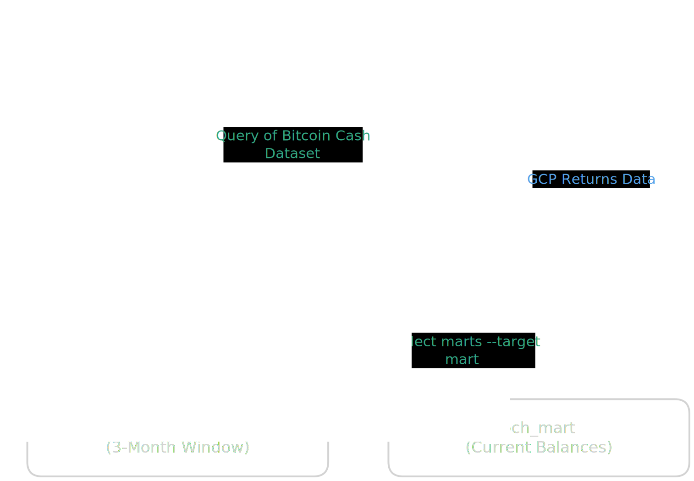

# Bitcoin Cash Analytics Pipeline

End-to-end analytics solution take-home challenge using Google Cloud, Terraform, dbt-core, and GitHub Actions.

## Overview

This project is split into two repositories:

* `bch-terraform`: provisions the Google Cloud foundation required by the challenge, all done with code.
* `bch-dbt`: contains the dbt project, SQL models, and GitHub Actions workflow that runs the transformations in pull requests.

The solution follows the assignment requirements by:

* Creating a new Google Cloud project with Terraform (Not done manually)
* Provisioning the BigQuery staging and mart datasets
* Creating a dedicated service account for dbt CI runs
* Building a staging model on the public Bitcoin Cash dataset
* Building a mart model that returns current balances per address while excluding Coinbase addresses as specified
* Running dbt automatically in GitHub Actions on `pull requests` or when there is a `commit`.

## Architecture

The data flow is:



1. Terraform creates the GCP project and BigQuery datasets.
2. Terraform also creates a service account and grants it BigQuery permissions.
3. dbt reads from `bigquery-public-data.crypto_bitcoin_cash.transactions`.
4. The staging model filters the raw transaction data to the most recent three months.
5. The mart model calculates current balances per address and excludes addresses with Coinbase transactions.
6. GitHub Actions authenticates to Google Cloud using the Terraform-provisioned service account and runs `dbt run` on pull requests.

## Repositories

### Terraform repository

`bch-terraform` provisions the cloud resources required by the dbt project.

It creates:

* a new Google Cloud project with a unique project ID,
* the BigQuery staging dataset,
* the BigQuery mart dataset,
* a service account for dbt CI/CD,
* the required BigQuery permissions for that service account,
* and the required Google Cloud APIs.

### dbt repository

`bch-dbt` contains the transformation logic.

Current project structure includes:

```markdown
    .
    ├── analyses
    ├── archDesign
    │   └── Architecture.svg
    ├── dbt-owner-key.json
    ├── dbt_project.yml
    ├── logs
    │   └── dbt.log
    ├── macros
    ├── main.py
    ├── models
    │   ├── marts
    │   │   └── mart_address_balances.sql
    │   └── staging
    │       ├── src_bch.yml
    │       └── stg_transactions.sql
    ├── profiles.yml
    ├── README.md
    ├── seeds
    ├── snapshots
    ├── target
    │   ├── compiled
    │   │   ├── bch_dbt
    │   │   └── bch_models
    │   ├── graph.gpickle
    │   ├── graph_summary.json
    │   ├── manifest.json
    │   ├── partial_parse.msgpack
    │   ├── run
    │   │   ├── bch_dbt
    │   │   └── bch_models
    │   ├── run_results.json
    │   └── semantic_manifest.json
    └── tests

```
## dbt models

### Staging model

`models/staging/stg_transactions.sql`

This model:

* sources the public BigQuery dataset `bigquery-public-data.crypto_bitcoin_cash.transactions`,
* renames `hash` to `tx_hash`,
* keeps transaction metadata such as `block_timestamp`, `inputs`, and `outputs`,
* and filters the data to the last three months relative to the latest date in the raw table.

The source is declared in `models/staging/src_bch.yml`.

### Mart model

`models/marts/mart_address_balances.sql`

This model:

* reads the full public Bitcoin Cash transactions table,
* unnests outputs to compute received amounts by address,
* unnests inputs to compute spent amounts by address,
* identifies Coinbase addresses from coinbase inputs,
* calculates `current_balance = total_received - total_spent`,
* and excludes any address that has at least one Coinbase transaction.

The mart is materialized as a table.

## CI/CD

The repository includes a GitHub Actions workflow at `.github/workflows/dbt_cli.yml`.

It runs on `pull_request` events targeting `main` or `master` and performs the following steps:

* checks out the code,
* sets up Python 3.11,
* authenticates to Google Cloud using a secret named `GCP_SA_KEY`,
* installs `dbt-bigquery` with `uv`,
* copies `profiles.yml` into `~/.dbt/`,
* runs the staging models with `dbt run --select staging --target staging`,
* and runs the mart models with `dbt run --select marts --target mart`.

## Prerequisites

### For Terraform

* Terraform CLI 1.10.0 or newer
* Google Cloud SDK (`gcloud`)
* A valid Google Cloud billing account

### For dbt

* Python 3.11
* Package Manager: `uv` ([Installation Guide](https://docs.astral.sh/uv/getting-started/installation/))
* Access to a Google Cloud service account JSON key
* A GitHub secret named `GCP_SA_KEY` containing that service account key

## Local setup

### 1. Provision infrastructure

Clone the Terraform repository and run:

```bash
gcloud auth application-default login
terraform init
terraform plan
terraform apply
```

### 2. Configure dbt credentials

The dbt project uses `profiles.yml` with `GOOGLE_APPLICATION_CREDENTIALS` as the service account key path.

Make sure the environment variable points to the downloaded service account JSON file:

```bash
export GOOGLE_APPLICATION_CREDENTIALS=/path/to/service-account.json
```

### 3. Install dbt dependencies

```bash
uv pip install --system dbt-bigquery
```

### 4. Run the models

```bash
dbt run --target staging
dbt run --target mart
```

### 5. Run tests

```bash
dbt test
```

## Configuration

### dbt profile

The project profile is `bch_dbt`.

It defines two targets:

* `staging` for the staging dataset,
* `mart` for the mart dataset.

Both targets use BigQuery in the `US` location.

### Terraform defaults

The Terraform project uses the following defaults:

* project ID prefix: `bch-astrafy-proj`
* staging dataset: `bch_staging`
* mart dataset: `bch_mart`
* service account: `dbt-ci-runner`
* BigQuery region: `US`

## Validation against the assignment

Part 2 requirements:

* **Create a new Google Cloud project using Terraform**: implemented in `bch-terraform`.
* **Create BigQuery datasets for staging and data mart tables**: implemented in Terraform.
* **Provision a service account with the necessary BigQuery permissions**: implemented in Terraform.
* **Materialize a staging table from `transactions` for the last three months**: implemented in `stg_transactions.sql`.
* **Materialize a data mart with current balances and Coinbase exclusion**: implemented in `mart_address_balances.sql`.
* **Run dbt in GitHub Actions on PR creation and new commits**: implemented in `dbt_cli.yml`.

## Notes

* The staging model is intentionally limited to the latest three months so it stays within the free-tier constraints described in the assignment.
* The mart model is built from the full public dataset because it needs historical activity to compute lifetime balances accurately.
* The Terraform project ID is generated with a random suffix to avoid collisions.

## Repository links

* Terraform: [`bch-terraform`](https://github.com/SebastianPerilla/bch-terraform)
* dbt project: [`bch-dbt`](https://github.com/SebastianPerilla/bch-dbt)

## Suggested next steps

* Add dbt tests for not-null and uniqueness checks on mart outputs.
* Add model documentation with `schema.yml` files.
* Add dependency caching to GitHub Actions to reduce CI runtime.
* Add a more explicit deployment workflow for production runs.
